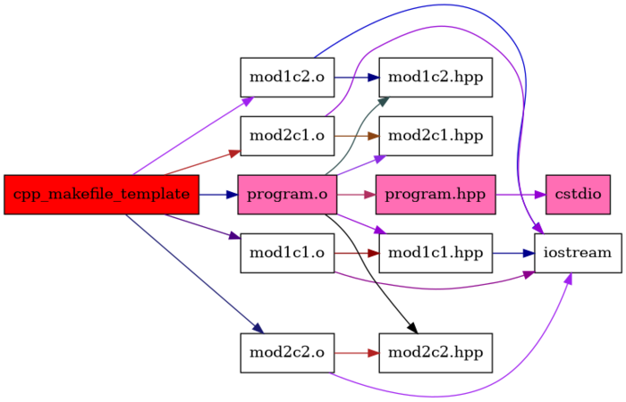

# C++ headers include graph

Do you want to see how looks headers include tree in your project? Then this tool is for You.

Generate headers include tree of whole C++ project in form of GraphViz graphs.
Tool parses output of `g++` and `clang` compiler and presents it in form of graph.


## How to use?

Generator as input needs build log of `gcc` or `clang` compiler. Compilation have to be done using `-H` flag
informing compiler to print include tree to `stderr`.
Passing the flag to `cmake` and obtaining build log can be done in following way:
```
    cmake -DCMAKE_C_COMPILER=gcc -DCMAKE_CXX_COMPILER=g++ \
          -DCMAKE_C_FLAGS="-H" \
          -DCMAKE_CXX_FLAGS="-H" \
          ...
    cmake --build . -- -j 1 2>&1 | tee build_log.txt
```
Similarly, running `Makefile` can be done like this:
```
    make CXX="g++" CXXFLAGS="-H" -j1 2>&1 | tee build_log.txt
```
Note that `cmake` and `make` have to be executed with one job only (`-j 1`), because otherwise compiler output will be 
interweaved and impossible to parse.

When build log is collected then it's time to execute the generator. 
There is example of generating graph for cmake output:
```
    cppincludegraphgen -lf build_log.txt --reduce_dirs "/opt" "/usr" --outdir include_graph_reduced
```
Whole commands list can be found [here](doc/cmd_args.txt). List is produced by calling `cppincludegraphgen --help`.
By argument `--reduce_dirs` generator is informed to *cut* subtree of headers in given directories amd present graph in reduced form (see examples). 
Other arguments seems to be straightforward.  

For more details see CMake and Makefile examples.


## CMake example

In `examples/cpp-cmake` there is example of include tree generated based on CMake project.

Generator is executed with following command for reduced and full graph respectively:
```
cppincludegraphgen -lf build_log.txt --reduce_dirs "/opt" "/usr" --outdir include_graph_reduced

cppincludegraphgen -lf build_log.txt --outdir include_graph_full
```

[](examples/cpp-cmake/include_graph_reduced/include_tree.gv.png)

[](examples/cpp-cmake/include_graph_full/include_tree.gv.png)


## Makefile example

In `examples/cpp-makefile` there is example of include tree generated based on Makefile project.

Generator is executed with following command for reduced and full graph respectively:
```
cppincludegraphgen -lf build_log.txt --build_regex "^g\+\+.*-o (\S*)$" --reduce_dirs "/opt" "/usr" --outdir include_graph_reduced

cppincludegraphgen -lf build_log.txt --build_regex "^g\+\+.*-o (\S*)$" --outdir include_graph_full
```

Note that there is `--build_regex` passed through command line. It highly depends on configuration of `Makefile` file and it's output to stdout.

[](examples/cpp-makefile/include_graph_reduced/include_tree.gv.png)

[](examples/cpp-makefile/include_graph_full/include_tree.gv.png)


## References

- [showgraph](https://github.com/anetczuk/showgraph-py)
- [Texthon](texthon.chipsforbrain.org/)


## License

BSD 3-Clause License

Copyright (c) 2022, Arkadiusz Netczuk <dev.arnet@gmail.com>

Redistribution and use in source and binary forms, with or without
modification, are permitted provided that the following conditions are met:

1. Redistributions of source code must retain the above copyright notice, this
   list of conditions and the following disclaimer.

2. Redistributions in binary form must reproduce the above copyright notice,
   this list of conditions and the following disclaimer in the documentation
   and/or other materials provided with the distribution.

3. Neither the name of the copyright holder nor the names of its
   contributors may be used to endorse or promote products derived from
   this software without specific prior written permission.

THIS SOFTWARE IS PROVIDED BY THE COPYRIGHT HOLDERS AND CONTRIBUTORS "AS IS"
AND ANY EXPRESS OR IMPLIED WARRANTIES, INCLUDING, BUT NOT LIMITED TO, THE
IMPLIED WARRANTIES OF MERCHANTABILITY AND FITNESS FOR A PARTICULAR PURPOSE ARE
DISCLAIMED. IN NO EVENT SHALL THE COPYRIGHT HOLDER OR CONTRIBUTORS BE LIABLE
FOR ANY DIRECT, INDIRECT, INCIDENTAL, SPECIAL, EXEMPLARY, OR CONSEQUENTIAL
DAMAGES (INCLUDING, BUT NOT LIMITED TO, PROCUREMENT OF SUBSTITUTE GOODS OR
SERVICES; LOSS OF USE, DATA, OR PROFITS; OR BUSINESS INTERRUPTION) HOWEVER
CAUSED AND ON ANY THEORY OF LIABILITY, WHETHER IN CONTRACT, STRICT LIABILITY,
OR TORT (INCLUDING NEGLIGENCE OR OTHERWISE) ARISING IN ANY WAY OUT OF THE USE
OF THIS SOFTWARE, EVEN IF ADVISED OF THE POSSIBILITY OF SUCH DAMAGE.
